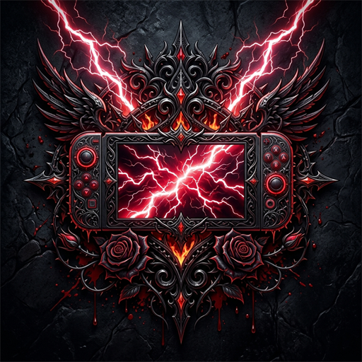

<!--
# SPDX-FileCopyrightText: Copyright 2026 STORM EDEN Project
# SPDX-FileCopyrightText: Copyright 2025 Eden Emulator Project
# SPDX-FileCopyrightText: Copyright 2018 yuzu Emulator Project
# SPDX-License-Identifier: GPL-3.0-or-later
-->

<p align="center">
  
</p>

<h1 align="center">
  <b>STORM EDEN</b>
  <br>
  <sub>Высокопроизводительный эмулятор Nintendo Switch для Windows и Android</sub>
</h1>

<p align="center">
  <a href="https://github.com/ReiKatari/STORM_EDEN/releases">
    
  </a>
  <a href="https://github.com/ReiKatari/STORM_EDEN/releases">
    
  </a>
  <a href="https://git.eden-emu.dev/eden-emu/eden">
    
  </a>
  <a href="https://github.com/ReiKatari/STORM_EDEN/blob/main/LICENSE.txt">
    
  </a>
</p>

---

## 🌟 О проекте STORM EDEN

**STORM EDEN** — это передовой форк эмулятора Nintendo Switch **Eden** (базирующегося на разработках **Yuzu**, **Citra**, **Ryujinx**, **Sudachi** и **Citron**), созданный **ReiKatari**. Проект нацелен на максимальную производительность, нативную поддержку сжатых форматов, глубокую интеграцию метаданных TitleDB, поддержку каталога модов GameBanana, фирменные темы STORM и полную синхронизацию функционала между настольной (Windows) и мобильной (Android) версиями.

---

## 🚀 Ключевые возможности STORM EDEN

### 📦 Полная нативная поддержка NSZ, XCZ и NCZ
* Прямой запуск игр в сжатых форматах **NSZ**, **XCZ** и разделов **NCZ** без предварительной распаковки.
* Аппаратное и программное декодирование Zstandard (zstd) в реальном времени с минимальным потреблением RAM и ресурсов CPU.
* Поддержка комплексных мульти-пакетов (Base + Updates + DLC) в едином файле.

### 📱 Полнофункциональная версия для Android
* **ARM64 Native Code Execution (NCE)**: прямое исполнение процессорного кода нативно на ARM-процессорах для максимального FPS и энергоэффективности.
* **Менеджер кастомных драйверов GPU (Mesa / Turnip / Freedreno)**: установка и переключение драйверов Vulkan на лету для чипов Qualcomm Snapdragon (Adreno) и MediaTek/Mali.
* **Каталог модов GameBanana**: встроенный поиск, загрузка и автоматическая установка пользовательских модификаций прямо в игре.
* **Интерактивные режимы отображения библиотеки**: Сетка (Grid), Компактная сетка (Compact Grid), Список (List с переносом строк до 3 строк) и Карусель (Carousel) с сохранением выбранного вида.
* **Мгновенное отображение версий и дополнений**: показ версии игры (например, `1.3.0`), точной внутренней версии патча (например, `196608`, `65536`), количества дополнений (`Дополнений: 5`) и бейджа формата файла (`NSP`, `NSZ`, `XCI`, `XCZ`) прямо на обложках.
* **Адаптивный интерфейс под системные панели**: корректные отступы списка игр, исключающие перекрытие элементов системной панелью навигации и жестами Android.
* **Компактное окно свойств игры**: быстрый доступ к DLC, обновлениям, модам, шейдерам и сохранениям.

### 🗃️ Интеграция с базой данных TitleDB
* Встроенная база `titledb.json` для автоматического распознавания названий игр, идентификаторов (Title ID), описаний и обложек.
* Автоматическая валидация TitleKeys для официальных тайтлов и DLC.
* Распознавание уникальных названий для каждого загружаемого дополнения (DLC) и обновления.

### 🎮 Продвинутый Менеджер дополнений (Addons Manager)
* Полный интерактивный список всех установленных компонентов: базовая игра, накопительные патчи, DLC и LayeredFS моды.
* Уникальные описания для дополнений без дублирования текста сюжета основной игры.
* Быстрый поиск и копирование метаданных в буфер обмена.

### 🎨 Эксклюзивные темы оформления STORM
* **STORM Themes**: Cyberpunk, Midnight, Night, Day, Gothic, Synthwave и др.
* Настраиваемый и информативный подвал (Status Bar) в Windows и адаптивная стилизация компонентов в Android.

### ⚡ Производительность и стабильность
* Оптимизированный конвейер Vulkan с защитой от сбоев драйвера (Device Loss) при MSAA текстурах глубины.
* Поддержка алгоритмов масштабирования FSR, Bilinear, Bicubic, Gaussian, а также сглаживания FXAA и SMAA.
* Встроенный **Discord Rich Presence**.

---

## 🛠️ Сборка из исходного кода

### Windows (Visual Studio 2022 / CMake / Ninja)
```bat
git clone https://github.com/ReiKatari/STORM_EDEN.git
cd STORM_EDEN
cmake -B build -G "Ninja" -DCMAKE_BUILD_TYPE=Release
cmake --build build --config Release
```

### Android (Android Studio / Gradle / NDK)
```bat
cd src/src/android
gradlew.bat assembleMainlineRelease
```

---

## 🤝 Благодарности и используемые компоненты

Проект **STORM EDEN** выражает искреннюю благодарность создателям эмуляторов и разработчикам открытого ПО:

* **Eden Emulator Project & Camille LaVey** — оригинальный проект и фундамент эмулятора.
* **Yuzu Emulator Team** — легендарная архитектура эмуляции Nintendo Switch.
* **Ryujinx Team** — исследования, документация и реверс-инжиниринг HLE сервисов Horizon OS.
* **Skyline / Strato Team** — передовые наработки ARM64 NCE и техники оптимизации под мобильные платформы.
* **Mesa, Freedreno & Turnip Teams (Bylaws, Danylo и др.)** — разработка открытых драйверов Vulkan под GPU Adreno.
* **Sudachi & Citron Projects** — полезные наработки и оптимизации для мобильных и настольных платформ.
* **Tinfoil & Blawar** — спецификация формата NSZ/NCZ и глобальная база данных TitleDB.
* **Zstandard (zstd)** — высокоскоростная библиотека сжатия данных от Yann Collet (Meta).
* **FFmpeg Team** — мультимедийный движок для аппаратного и программного декодирования видео/аудио.
* **Dynarmic** — динамический рекомпилятор ARMv8.
* **Qt Project** — фреймворк Qt6 для Windows.
* **Vulkan SDK & LunarG** — графический API Vulkan.

---

## 📜 Лицензия

**STORM EDEN** распространяется под условиями свободной лицензии **GNU General Public License v3.0 (GPLv3)** или более поздней версии. Полный текст лицензии доступен в файле [LICENSE.txt](LICENSE.txt).

